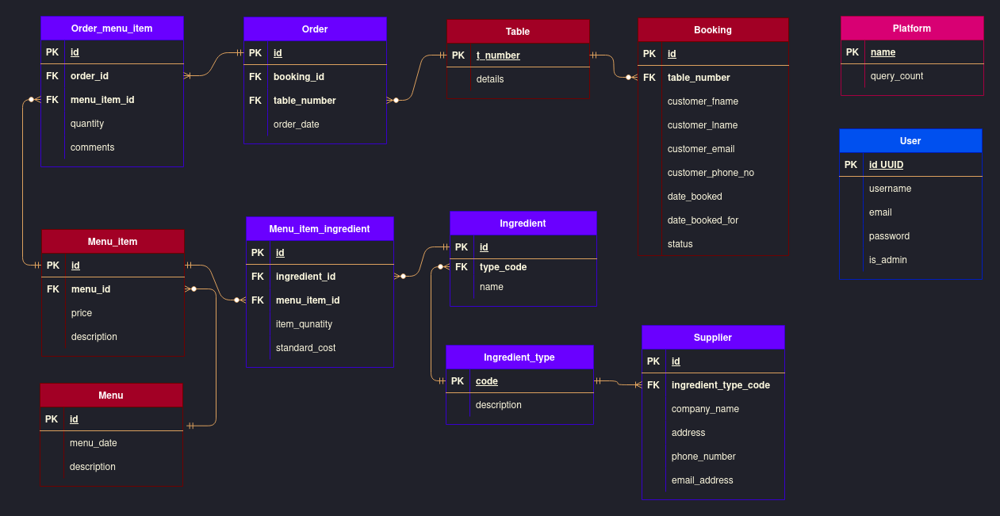

# node-postgres-api
## What is it?
Repo for API for fictional restaurant "Miruna" written using Node.js express and PostgreSQL

## Models

## Setting up
#### Deploy database

1. Create database DATABASE_NAME
2. Create tables, constraints and insert initial records using following command:

`psql -d DATABASE_NAME -f db/create_tables.sql`

repeat for other files in db/

#### Configs

1. Add database URL to enviromental variables or set it in .env file
2. Add server listening port to environmental variables or set it in config file. Default: `3000`

#### Install packages
`npm install`

#### Run server
Execute `npm start` from / directory

Or `npm test` to start the server with nodemon

> Check out the description of routes on / path, or source code instead